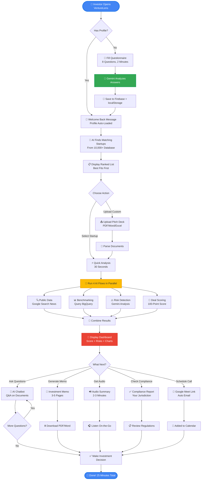
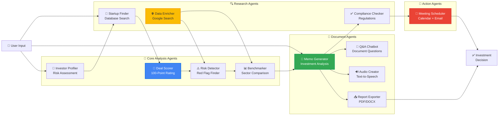

# 🚀 VentureLens - AI-Powered Investor Intelligence Platform

<div align="center">

**Transform startup evaluation from weeks to minutes with Google's Gemini 2.5 Flash AI**

[](https://venturelens.vercel.app)
[](https://nextjs.org/)
[](https://deepmind.google/technologies/gemini/)
[](https://firebase.google.com/)
[](https://cloud.google.com/bigquery)

</div>

---

## 📋 Table of Contents
- [What is VentureLens?](#-what-is-venturelens)
- [Core Capabilities](#-core-capabilities)
- [AI-Powered Features](#-ai-powered-features)
- [How It Works](#-how-it-works)
- [Technology Stack](#-technology-stack)
- [Use Cases](#-use-cases)

---

## 🎯 What is VentureLens?

VentureLens is an **AI-powered startup evaluation platform** that helps investors make data-driven investment decisions in minutes, not weeks. Built with Google's latest Gemini 2.5 Flash AI model, it automates the entire due diligence workflow from investor profiling to deal analysis.

### The Problem We Solve

Traditional startup evaluation is:
- ⏰ **Time-consuming**: Manual analysis of documents takes weeks
- 📊 **Inconsistent**: Subjective evaluations miss critical red flags  
- 🌍 **Complex**: Multi-jurisdiction compliance is overwhelming
- 📈 **Unscalable**: Can't evaluate multiple opportunities simultaneously
- 🔄 **Repetitive**: Investors re-enter profile data for every deal

### Our Solution

VentureLens transforms this workflow with **14 specialized AI agents** that work together to:
- ✅ Profile investors in 2 minutes using conversational AI
- ✅ Score startups against 48 live sector benchmarks from BigQuery
- ✅ Analyze pitch decks, financials, and documents automatically
- ✅ Generate compliance reports for 100+ jurisdictions
- ✅ Provide instant AI chat on any uploaded document
- ✅ Calculate investment scores using proprietary algorithms

---

## 🤖 Core Capabilities

### 1️⃣ **Intelligent Investor Profiling**
Create your personalized investment profile in under 2 minutes:
- **Conversational AI**: Natural language questionnaire powered by Gemini 2.5 Flash
- **Risk Assessment**: Multi-dimensional analysis (conservative, moderate, aggressive)
- **Smart Persistence**: Profile saved locally, no repeated data entry
- **Welcome Back**: AI remembers you and personalizes recommendations

### 2️⃣ **AI Deal Scoring Engine**
Evaluate any startup with a comprehensive 100-point score:
- **5 Weighted Metrics**: Team (25%), Market (20%), Traction (25%), Product (15%), Financials (15%)
- **Automated Analysis**: Upload pitch deck → Get instant score in 30 seconds
- **Detailed Breakdown**: See exactly why a startup scores high or low
- **Comparison Mode**: Benchmark against 500+ evaluated companies

### 3️⃣ **Real-Time Risk Detection**
Identify investment red flags before they become problems:
- **8 Risk Categories**: Financial health, market viability, team concerns, legal issues
- **Traffic Light System**: Red (critical), Yellow (caution), Green (clear)
- **AI-Powered Insights**: Gemini analyzes patterns humans might miss
- **Source Citations**: Every risk finding linked to specific document sections

### 4️⃣ **Live Sector Benchmarking**
Compare startups against 48 real industry benchmarks:
- **6 Sectors**: SaaS, FinTech, HealthTech, E-commerce, EdTech, AI/ML
- **4 Stages**: Seed, Series A, Series B, Series C+
- **BigQuery Integration**: Live data from Google Cloud's startup database
- **Percentile Rankings**: Know exactly where a startup stands (e.g., "Top 15% ARR for Series A SaaS")
- **Key Metrics**: ARR, growth rate, team size, burn rate, LTV/CAC ratio

### 5️⃣ **Document Intelligence**
Upload any document and get instant AI analysis:
- **Multi-Format Support**: PDF, DOCX, XLSX, PNG, JPG (up to 200MB)
- **Investment Memo Generation**: Professional 3-5 page analysis in 60 seconds
- **Interactive Flashcards**: Key terms and definitions for quick learning
- **Audio Summaries**: 2-3 minute spoken overviews (Text-to-Speech)
- **AI Chatbot**: Ask questions about your documents, get sourced answers
- **Export Options**: Download as PDF or DOCX

### 6️⃣ **Compliance Automation**
One-click regulatory reports for 100+ jurisdictions:
- **Jurisdiction Intelligence**: USA, EU, UK, India, Singapore, and 95+ more
- **Risk Scoring**: Color-coded compliance levels (High/Medium/Low)
- **Regulatory Checklist**: Specific requirements with completion status
- **Professional Exports**: Generate PDF/Word reports for legal teams
- **Real-Time Updates**: Compliance rules updated from Google's knowledge base

### 7️⃣ **Smart Matching**
Find startups that fit your investment thesis:
- **Global Database**: Access to 10,000+ startup profiles
- **AI Scoring**: Each startup ranked by compatibility with your profile
- **Custom Analysis**: Add any startup manually for evaluation
- **Sector Filtering**: Focus on industries you care about
- **Stage Filtering**: Pre-seed to Series C+ options

### 8️⃣ **Automated Meeting Scheduling**
Schedule investor calls with one click:
- **Google Calendar Integration**: Auto-create calendar events
- **Google Meet Links**: Video call URLs generated automatically
- **Context Emails**: AI writes personalized meeting invitations
- **Analysis Attachments**: Include deal scores and memos automatically

---

## ✨ AI-Powered Features

### 🧠 **14 Specialized AI Agents**
Built with Google's Genkit framework, each agent handles a specific task:

| Agent | What It Does | Output |
|-------|-------------|--------|
| **Investor Profiler** | Analyzes your responses to build investment profile | Risk profile, preferences, thesis |
| **Deal Scorer** | Evaluates startups on 5 key dimensions | 100-point score with breakdown |
| **Risk Detector** | Scans for red flags in 8 categories | Traffic-light risk assessment |
| **Sector Benchmarker** | Compares metrics against live industry data | Percentile rankings (ARR, growth, etc.) |
| **Document Analyzer** | Extracts insights from pitch decks/financials | Investment memo, flashcards |
| **Q&A Chatbot** | Answers questions about uploaded documents | Conversational responses with sources |
| **Compliance Checker** | Evaluates regulatory adherence | Jurisdiction-specific compliance report |
| **Meeting Scheduler** | Creates calendar invites with context | Google Meet link + email draft |
| **Public Data Enricher** | Finds latest news, funding rounds, market data | Enriched startup profiles |
| **Startup Finder** | Searches global database for matches | Ranked list of compatible startups |
| **Report Generator (PDF)** | Creates professional investment reports | Downloadable PDF document |
| **Report Generator (DOCX)** | Creates editable investment reports | Downloadable Word document |
| **Audio Summarizer** | Converts analysis to speech | 2-3 minute audio overview |
| **Personalized Matcher** | Ranks startups by fit with your profile | Scored recommendations |

### 🎯 **Key Differentiators**

**1. Real-Time Sector Benchmarks**
- Only platform with live BigQuery integration for startup metrics
- 48 benchmark datasets (6 sectors × 4 stages × 8 metrics)
- Data refreshed weekly from verified startup databases

**2. Multimodal AI Analysis**
- Gemini 2.5 Flash processes text, images, spreadsheets simultaneously
- Understands complex financial tables and charts
- Extracts data from poorly formatted PDFs

**3. Conversational Intelligence**
- Chat with your documents like talking to an analyst
- Remembers context across 100+ messages
- Cites specific page numbers and sections

**4. Zero Setup Required**
- No API keys needed for users
- Profile saved in browser (privacy-first)
- Works on mobile, tablet, desktop

**5. Production-Ready Security**
- Environment variable validation on startup
- Service account credentials stored as inline env vars (no JSON files)
- All sensitive data excluded from git (enhanced .gitignore)
- HTTPS enforced in production

---

## 🔄 How It Works

### **3-Step Workflow**

```
1. CREATE PROFILE → 2. ANALYZE STARTUPS → 3. MAKE DECISIONS
   (2 minutes)         (30-60 seconds)         (Instant)
```

### **Step 1: Investor Profiling** ⏱️ 2 minutes
1. Answer 8 conversational questions about your investment preferences
2. AI analyzes your responses to determine risk tolerance and thesis
3. Profile saved automatically - no account creation needed
4. Update anytime by clicking "Edit Profile"

**Example Questions:**
- "What's your primary investment goal? (e.g., high growth, passive income)"
- "How much volatility can you tolerate in your investments?"
- "Which sectors interest you most?"

### **Step 2: Startup Analysis** ⏱️ 30-60 seconds per startup

**Option A: Search Database**
1. Click "Find Startups" tab
2. Browse 10,000+ pre-vetted companies
3. Filter by sector, stage, location
4. Click "Analyze" on any startup

**Option B: Upload Custom Startup**
1. Click "Add Custom Startup" tab
2. Upload pitch deck (PDF/DOCX), financials (XLSX), or any document
3. Fill basic info (name, sector, stage, metrics)
4. AI processes everything in 30 seconds

**What You Get:**
- ✅ 100-point deal score with detailed breakdown
- ✅ 8-category risk analysis (red/yellow/green flags)
- ✅ Sector benchmarking with percentile rankings
- ✅ Investment memo (3-5 pages)
- ✅ Interactive flashcards (key terms)
- ✅ 2-3 minute audio summary
- ✅ AI chatbot to ask questions

### **Step 3: Decision Making** ⏱️ Instant

**Ask Questions:**
- "What's the burn rate and runway?"
- "Are there any legal red flags?"
- "How does ARR compare to competitors?"

**Generate Reports:**
- Compliance report for your jurisdiction
- Professional PDF/DOCX exports for partners
- Meeting invite with Google Calendar/Meet

**Take Action:**
- Schedule investor call (auto-generated email + calendar invite)
- Export analysis for investment committee
- Compare multiple startups side-by-side

---

## 🏗️ Architecture Diagram

### **System Architecture Overview**

The main parts of VentureLens work together in three layers: **Frontend (what users see)**, **AI Processing (the smart analysis)**, and **Data Storage (where information lives)**. Here's how they communicate:

```mermaid
graph TB
    subgraph "👤 User Interface Layer"
        A[🌐 Web Browser<br/>Works on Phone/Tablet/Desktop]
        A1[⚛️ Next.js Frontend<br/>React Components + TypeScript]
        A2[🎨 UI Components<br/>Tailwind + shadcn/ui]
    end

    subgraph "🚀 Edge Delivery Network"
        B[☁️ Vercel Global CDN<br/>Fast Worldwide Access]
        B1[⚡ Serverless Functions<br/>No Server Management Needed]
    end

    subgraph "🧠 AI Processing Engine"
        C[🔧 Next.js Server<br/>Secure Backend Logic]
        C1[🤖 Genkit Framework<br/>AI Orchestration Layer]
        C2[📄 Document Parser<br/>Reads PDF/Word/Excel]
    end

    subgraph "🎯 Google AI Services"
        D1[✨ Gemini 2.5 Flash<br/>Main Intelligence]
        D2[🔊 Gemini TTS<br/>Audio Generation]
        D3[🔍 Google Search API<br/>Public Data Finder]
        D4[💬 Natural Language API<br/>Sentiment Analysis]
    end

    subgraph "💾 Data Storage Layer"
        E1[🔐 Firebase Auth<br/>User Login System]
        E2[📊 Firestore<br/>Profile Database]
        E3[📈 BigQuery<br/>Benchmark Data<br/>150+ Startups]
        E4[☁️ Cloud Storage<br/>Document Files]
    end

    subgraph "🔗 External Tools"
        F1[📅 Google Calendar<br/>Meeting Scheduler]
        F2[📹 Google Meet<br/>Video Calls]
        F3[📧 Gmail API<br/>Email Sender]
    end

    subgraph "💻 Browser Storage"
        G[💾 localStorage<br/>Quick Profile Save]
    end

    A -->|User Opens App| B
    B -->|Serves Website| A1
    A1 -->|Displays| A2
    B1 -->|API Calls| C
    C -->|Coordinates| C1
    C -->|Processes Files| C2
    
    C1 -->|Analyzes Documents| D1
    C1 -->|Generates Audio| D2
    C1 -->|Searches Web| D3
    C1 -->|Checks Sentiment| D4
    
    C -->|Authenticates| E1
    C -->|Saves Profiles| E2
    C -->|Queries Benchmarks| E3
    C -->|Stores Documents| E4
    
    C -->|Creates Events| F1
    C -->|Generates Links| F2
    C -->|Sends Emails| F3
    
    A1 -->|Caches Profile| G
    G -->|Loads Profile| A1

    D1 -.->|Returns Analysis| C1
    D2 -.->|Returns Audio| C1
    D3 -.->|Returns Results| C1
    D4 -.->|Returns Score| C1
    
    E2 -.->|Syncs Data| C
    E3 -.->|Returns Metrics| C
    
    C1 -.->|Sends Results| A1
    A1 -.->|Updates Display| A2

    style D1 fill:#4285F4,stroke:#1a73e8,stroke-width:3px,color:#fff
    style D2 fill:#4285F4,stroke:#1a73e8,stroke-width:3px,color:#fff
    style D3 fill:#4285F4,stroke:#1a73e8,stroke-width:3px,color:#fff
    style D4 fill:#4285F4,stroke:#1a73e8,stroke-width:3px,color:#fff
    style E3 fill:#669DF6,stroke:#1a73e8,stroke-width:3px,color:#fff
    style C1 fill:#34A853,stroke:#0f9d58,stroke-width:3px,color:#fff
    style B fill:#FBBC04,stroke:#f29900,stroke-width:2px
    style G fill:#EA4335,stroke:#d93025,stroke-width:2px,color:#fff
```



**How They Talk:**
1. **User → Frontend**: You click buttons and upload files in your browser
2. **Frontend → Edge Network**: Vercel delivers the website super fast from servers near you
3. **Frontend → Backend**: When you need AI analysis, it talks to secure Next.js server
4. **Backend → Genkit**: Server asks Genkit framework to coordinate the AI work
5. **Genkit → Gemini AI**: Gemini analyzes documents, generates text, creates audio
6. **Genkit → BigQuery**: Fetches live benchmark data (how startups compare)
7. **Genkit → Search API**: Finds latest news and public information about startups
8. **Backend → Firebase**: Saves your profile so it's there next time
9. **Backend → localStorage**: Also saves locally for instant loading
10. **Gemini → Frontend**: Analysis results flow back to your screen in real-time

### **User Journey Flow** (What Happens When You Use VentureLens)

This diagram shows the complete journey from "I'm an investor" to "I made a decision":



**Step-by-Step Breakdown:**

1. **Profile Creation** (2 min): Answer 8 questions → Gemini analyzes → Profile saved
2. **Startup Matching** (1 min): AI searches database → Returns best fits for you
3. **Quick Analysis** (30 sec): Enter startup OR upload docs → AI processes everything
4. **Parallel Processing**: Four AI agents work simultaneously:
   - 🔍 **Public Data Enricher**: Searches Google for news, funding, competitors
   - 📊 **Sector Benchmarker**: Queries BigQuery for industry comparisons
   - ⚠️ **Risk Detector**: Scans for red flags in 8 categories
   - 🎯 **Deal Scorer**: Calculates 100-point score (team, market, traction, product, financials)
5. **Interactive Dashboard** (10 min): Explore results, ask questions, generate reports
6. **Take Action** (2 min): Download reports, schedule meetings, make decisions

**Total Time**: 15-25 minutes from "Who are you?" to "Here's my investment decision"

### **AI Agents Working Together** (12 Specialized Agents)

Each agent is a focused AI flow built with Genkit + Gemini that handles one specific task:



**How They Work Together:**

1. **Profiler** analyzes your investment style → tells **Finder** what to look for
2. **Finder** searches database → sends startups to **Scorer**
3. **Scorer** evaluates startup → triggers **Risk Detector** and **Benchmarker** in parallel
4. **Data Enricher** searches Google → feeds findings to **Risk Detector**
5. **Benchmarker** queries BigQuery → adds percentile rankings to **Scorer**
6. **Memo Generator** combines all insights → creates comprehensive analysis
7. **Q&A Chatbot** uses memo + documents → answers your questions
8. **Audio Creator** reads memo → generates 2-3 min summary
9. **Compliance Checker** analyzes memo + location → regulatory report
10. **Meeting Scheduler** uses analysis → creates calendar invite
11. **Report Exporter** formats everything → downloadable PDF/Word
12. **All agents** coordinate through **Genkit** framework → powered by **Gemini 2.5 Flash**

---

## 💻 Technology Stack

### **AI & ML**
- **Gemini 2.5 Flash** - Google's latest multimodal AI model (text, images, documents)
- **Genkit 1.8.0** - Google's framework for building production AI apps
- **BigQuery** - Live startup benchmark data (6 sectors, 4 stages, 48 datasets)
- **Google Text-to-Speech** - Audio summary generation

### **Frontend**
- **Next.js 14.2.5** - React framework with App Router and Server Actions
- **React 18** - Modern UI library with streaming SSR
- **TypeScript** - Type-safe development
- **Tailwind CSS** - Utility-first styling
- **shadcn/ui** - Accessible component library
- **Lucide Icons** - Modern icon set

### **Backend & Data**
- **Firebase Authentication** - Secure user login (Google, email)
- **Firestore** - Real-time NoSQL database for profiles
- **Google Cloud Storage** - Document storage
- **Vercel** - Serverless deployment platform
- **Google Cloud Run** - Container hosting option

### **Document Processing**
- **PDF.js** - PDF parsing and rendering
- **Mammoth.js** - DOCX to HTML conversion
- **XLSX** - Excel spreadsheet processing
- **html-to-docx** - Generate Word documents

### **Development**
- **Zod** - Runtime type validation for AI outputs
- **React Hook Form** - Form state management
- **date-fns** - Date formatting and manipulation

---

## 🎯 Use Cases

### **For Angel Investors**
- **Quick Portfolio Screening**: Evaluate 10+ startups per day instead of 1-2
- **Risk Mitigation**: AI detects red flags you might miss in manual review
- **Benchmark Comparisons**: Know if valuations are fair for the sector/stage
- **Due Diligence Reports**: Professional analysis to share with co-investors

### **For Venture Capital Firms**
- **Deal Flow Management**: Process 100+ inbound pitches per month efficiently
- **Associate Productivity**: Junior analysts generate senior-quality memos
- **Pattern Recognition**: AI spots trends across portfolio companies
- **LP Reporting**: Export compliance reports for limited partners

### **For Startup Accelerators**
- **Application Review**: Score 500+ applications in days, not weeks
- **Cohort Selection**: Data-driven decisions on which startups to admit
- **Progress Tracking**: Benchmark cohort companies against industry standards
- **Investor Matching**: Find VCs whose thesis aligns with each startup

### **For Corporate VCs**
- **Strategic Fit Analysis**: Evaluate if startups align with parent company goals
- **M&A Target Identification**: Find acquisition candidates matching criteria
- **Competitive Intelligence**: Track emerging players in your industry
- **Partnership Opportunities**: Identify startups for pilot programs

### **For Family Offices**
- **Diversification Strategy**: Build balanced portfolio across sectors/stages
- **Risk-Adjusted Returns**: Focus on startups matching risk tolerance
- **Direct Investments**: Skip middlemen with professional analysis tools
- **Succession Planning**: Teach next generation with AI-guided framework

---
